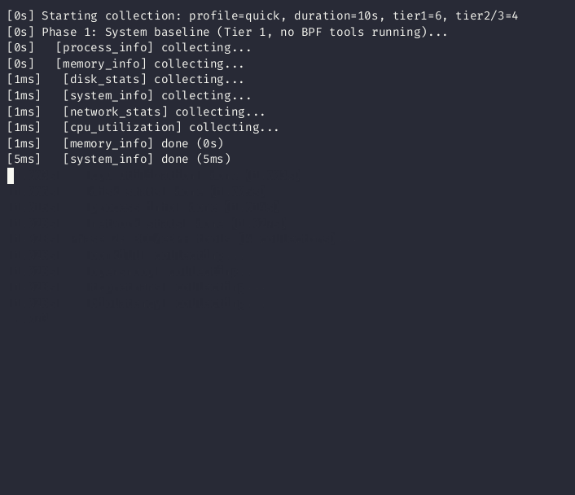

# melisai



**Your server is slow. You SSH in. Now what?**

melisai answers that question in 10 seconds. Single Go binary — no agents, no daemons, no config files. It runs 67 BCC/eBPF tools + 8 procfs collectors, detects 37 anomalies, computes a health score, and tells you exactly what sysctl to change. Works standalone or as an MCP server for Claude/Cursor to diagnose servers interactively.

[](https://go.dev)
[](LICENSE)
[](https://github.com/iovisor/bcc)
[]()
[]()

```
$ sudo melisai collect --profile quick -o report.json

  melisai v0.4.1 | profile=quick | duration=10s

  Tier 1 (procfs)  ████████████████████████████████████████ 8/8   2.1s
  Tier 2 (BCC)     ████████████████████████████████████████ 4/4  10.3s

  Health Score:  68 / 100  ⚠️
  Anomalies:     cpu_utilization CRITICAL (98.7%)
                 load_average WARNING (3.2x CPUs)
  Recommendations: 2

  Report saved to report.json
```

---

## Key Features

| Feature | What it does |
|---------|-------------|
| **Health Score** | Single 0-100 number. Green/yellow/red. AI agents use it to decide next steps |
| **37 Anomaly Rules** | Rate-based detection (not cumulative counters). Catches problems happening *right now* |
| **35 Recommendations** | Copy-paste `sysctl` commands with evidence. Each tagged as "fix" or "optimization" |
| **67 BCC Tools** | ~84% of Brendan Gregg's BPF toolkit. Histograms, events, stack traces |
| **GPU/PCIe Topology** | Detects NVIDIA GPUs, maps PCI→NUMA, flags cross-NUMA GPU-NIC pairs (30-50% DMA penalty) |
| **Page Reclaim Tracking** | Direct reclaim rate, compaction stalls, THP splits — the invisible latency killers |
| **NUMA Analysis** | Per-node miss ratio, distance matrix, CPU mapping. Catches 30-50% latency penalties |
| **Network Deep Dive** | Conntrack, softnet, IRQ distribution, accept queue depth, 30+ TCP/UDP sysctls |
| **MCP Server** | Claude Desktop / Cursor connect over stdio. Interactive server diagnostics |
| **Before/After Diff** | Compare two reports. See what improved, what regressed |
| **Observer Effect Mitigation** | Two-phase collection: baselines first, then BCC tools. PID exclusion |
| **22 Chapter Documentation** | Book-level guide (EN + RU) covering CPU, memory, disk, network, GPU, NUMA, THP |

---

## Who Is This For?

- **SRE / DevOps** — "server is slow, find out why" in one command
- **ML Engineers** — GPU-NIC NUMA topology, PCIe bandwidth diagnostics
- **Database Admins** — THP splits, page reclaim, dirty writeback, NUMA miss ratio
- **Platform Teams** — container CPU throttling, cgroup memory pressure, K8s NUMA topology
- **AI Agents** — structured JSON + MCP protocol = autonomous server diagnostics

---

## Why Not prometheus/netdata/datadog?

| | melisai | Monitoring agents |
|---|---------|-------------------|
| **Deployment** | Single binary, run once | Daemon + config + server |
| **Time to answer** | 10 seconds | Set up dashboards, wait for data |
| **BPF tools** | 67 tools in one run | Separate setup per tool |
| **Recommendations** | Exact sysctl commands | Raw metrics only |
| **AI-native** | MCP server, structured JSON, AI prompt | Requires adapter/integration |
| **GPU topology** | Cross-NUMA detection | Not typically covered |
| **Cost** | Free, Apache 2.0 | Free to $$$ |

melisai is not a replacement for monitoring — it's a **diagnostic tool** you run when something is already wrong (or to validate that everything is right).

---

## Quick Start

```bash
# Build (requires Go 1.23+, cross-compile from macOS/Linux)
GOOS=linux GOARCH=amd64 CGO_ENABLED=0 go build -o melisai ./cmd/melisai/

# Deploy and run
scp melisai root@server:/usr/local/bin/
ssh root@server "melisai collect --profile quick -o /tmp/report.json"

# Install BCC tools (first time only)
ssh root@server "melisai install"
```

No config files. No YAML. No environment variables.

---

## MCP Server — AI-Powered Diagnostics

melisai includes a built-in [Model Context Protocol](https://modelcontextprotocol.io/) server. AI agents connect over stdio and interactively diagnose system performance.

**Claude Desktop / Cursor config** (`claude_desktop_config.json`):

```json
{
  "mcpServers": {
    "melisai": {
      "command": "ssh",
      "args": ["root@your-server", "/usr/local/bin/melisai", "mcp"]
    }
  }
}
```

### MCP Tools

| Tool | What it does | Time |
|------|-------------|------|
| `get_health` | Quick 0-100 score + anomalies. Tier 1 only | ~2s |
| `collect_metrics` | Full profile with BCC/eBPF tools. Args: `profile`, `focus`, `pid` | 10-60s |
| `explain_anomaly` | Root causes + recommendations for any anomaly ID | instant |
| `list_anomalies` | All 37 anomaly metric IDs with descriptions | instant |

### Typical AI Workflow

```
Agent                              melisai
  │                                   │
  ├── get_health ──────────────────►  │  "score: 68, cpu_utilization CRITICAL"
  │                                   │
  ├── explain_anomaly ─────────────►  │  "Root causes, what to check, sysctl fixes..."
  │   anomaly_id: cpu_utilization     │
  │                                   │
  ├── collect_metrics ─────────────►  │  Full JSON: 67 BCC tools, histograms,
  │   profile: standard               │  events, stack traces, AI prompt
  │                                   │
  └── (agent analyzes & recommends)   │
```

---

## How It Works

Three collection tiers with automatic fallback:

```
Tier 1: 8 collectors (/proc, /sys, ss, ethtool, nvidia-smi, dmesg)
        Network deep diagnostics, page reclaim & THP tracking,
        NUMA topology analysis, GPU/PCIe cross-NUMA detection
        Always works. No root needed.

Tier 2: 67 BCC tools — runqlat, biolatency, tcpconnlat, etc.
        Root + bcc-tools required. `melisai install` handles setup.

Tier 3: Native eBPF (cilium/ebpf) — tcpretrans kprobe
        Root + kernel ≥ 5.8 + BTF. Zero external dependencies.
```

Collection runs in **two phases** to eliminate observer effect:
1. **Phase 1** — Tier 1 collectors capture clean baselines
2. **Phase 2** — BCC/eBPF tools run without contaminating baselines

### Report Structure

| Section | Content |
|---------|---------|
| `summary.health_score` | Weighted 0-100 score (CPU 1.5x, Memory 1.5x, Disk 1.0x, Network 1.0x) |
| `summary.anomalies[]` | Detected issues with severity, metric, value, threshold |
| `summary.resources` | USE metrics per resource (utilization, saturation, errors) |
| `summary.recommendations[]` | Exact commands with `type` (fix/optimization) and evidence |
| `categories.*` | Raw data: histograms, events, stack traces per subsystem |
| `ai_context.prompt` | Dynamic prompt with system context and 27 anti-patterns |

---

## Collection Profiles

| Profile | Duration | What runs | Best for |
|---------|----------|-----------|----------|
| **quick** | 10s | Tier 1 + biolatency, tcpretrans, opensnoop, oomkill | Health checks, CI gates |
| **standard** | 30s | All Tier 1 + all 67 BCC tools | Regular diagnostics |
| **deep** | 60s | Everything + memleak, biostacks, wakeuptime, biotop | Root cause analysis |

```bash
# Quick health check
sudo melisai collect --profile quick -o report.json

# Full analysis with AI prompt
sudo melisai collect --profile standard --ai-prompt -o report.json

# Deep dive focused on disk
sudo melisai collect --profile deep --focus disk -o report.json

# Profile a specific process
sudo melisai collect --profile standard --pid 12345 -o app.json

# Profile a container
sudo melisai collect --profile standard --cgroup /sys/fs/cgroup/system.slice/nginx.service -o nginx.json

# Compare before/after a change
melisai diff before.json after.json -o diff.json
```

---

## Anomaly Detection — 37 Rules

All rate-based rules use two-point sampling (delta over interval). No false positives from cumulative counters on long-uptime systems.

| Metric | Warning | Critical | Source |
|--------|---------|----------|--------|
| cpu_utilization | 80% | 95% | /proc/stat |
| cpu_iowait | 10% | 30% | /proc/stat |
| load_average | 2x CPUs | 4x CPUs | /proc/loadavg |
| memory_utilization | 85% | 95% | /proc/meminfo |
| swap_usage | 10% | 50% | /proc/meminfo |
| direct_reclaim_rate | 10/s | 1000/s | /proc/vmstat (rate) |
| compaction_stall_rate | 1/s | 100/s | /proc/vmstat (rate) |
| thp_split_rate | 1/s | 100/s | /proc/vmstat (rate) |
| numa_miss_ratio | 5% | 20% | /sys/devices/system/node |
| disk_utilization | 70% | 90% | /proc/diskstats |
| disk_avg_latency | 5ms | 50ms | /proc/diskstats |
| tcp_retransmits | 10/s | 50/s | /proc/net/snmp (rate) |
| conntrack_usage_pct | 70% | 90% | /proc/sys/net/netfilter |
| softnet_dropped | 1/s | 100/s | /proc/net/softnet_stat (rate) |
| listen_overflows | 1/s | 100/s | /proc/net/netstat (rate) |
| tcp_close_wait | 1 | 100 | ss |
| tcp_rcvq_drop | 1/s | 100/s | /proc/net/netstat (rate) |
| tcp_zero_window_drop | 1/s | 50/s | /proc/net/netstat (rate) |
| listen_queue_saturation | 70% | 90% | ss -tnl fill % |
| irq_imbalance | 5x | 20x | /proc/softirqs (rate) |
| gpu_nic_cross_numa | 1 pair | 1 pair | sysfs PCI NUMA |
| ... and 16 more (BCC histograms, PSI, container, NIC, UDP) | | | |

---

## BCC Tools — 67 Tools

~84% coverage of Brendan Gregg's [BPF observability tools](https://www.brendangregg.com/BPF/bcc-tracing-tools.png).

| Subsystem | Count | Tools |
|-----------|-------|-------|
| **CPU** | 10 | runqlat, runqlen, cpudist, hardirqs, softirqs, runqslower, cpufreq, cpuunclaimed, llcstat, funccount |
| **Disk** | 21 | biolatency, biosnoop, biotop, bitesize, ext4slower/dist, btrfsslower/dist, xfsslower/dist, nfsslower/dist, zfsslower/dist, fileslower, filelife, mountsnoop, mdflush, scsilatency, nvmelatency, vfsstat |
| **Memory** | 7 | cachestat, oomkill, drsnoop, shmsnoop, numamove, memleak, slabratetop |
| **Network** | 14 | tcpconnlat, tcpretrans, tcprtt, tcpdrop, tcpstates, tcpconnect, tcpaccept, tcplife, udpconnect, sofdsnoop, sockstat, skbdrop, tcpsynbl, gethostlatency |
| **Process** | 9 | execsnoop, opensnoop, killsnoop, threadsnoop, syncsnoop, exitsnoop, statsnoop, capable, syscount |
| **Stacks** | 6 | profile, offcputime, wakeuptime, offwaketime, biostacks, stackcount |

24 tools support `--pid` filtering for per-process analysis.

---

## Manual Usage (without AI)

```bash
# Health score
jq '.summary.health_score' report.json

# All anomalies
jq '.summary.anomalies[]' report.json

# Copy-paste recommendations
jq '.summary.recommendations[] | {type, title, commands}' report.json

# Network sysctls
jq '.categories.network[0].data.sysctls' report.json

# Page reclaim pressure
jq '.categories.memory[0].data.reclaim' report.json

# NUMA miss ratio per node
jq '.categories.memory[0].data.numa_nodes[] | {node, miss_ratio, cpus}' report.json

# Top CPU processes
jq '.categories.process[0].data.top_by_cpu[:5]' report.json

# BCC histogram percentiles
jq '.categories.cpu[].histograms[]? | {name, p50, p99, max}' report.json
```

---

## Documentation — 22 Chapters (EN + RU)

Comprehensive book-level guide covering Linux performance theory and melisai implementation:

| Chapters | Topic |
|----------|-------|
| 00-01 | Introduction, Linux fundamentals (/proc, /sys, cgroups, PSI) |
| 02-07 | CPU, Memory, Disk, Network, Process, Container analysis |
| 08-10 | System collector, BCC tools registry, Native eBPF |
| 11-13 | Anomaly detection (37 rules), Recommendations engine, AI integration |
| 14-17 | Report diffing, Orchestrator, Output formats, Appendix |
| **18** | **GPU & PCIe Topology** — nvidia-smi, NUMA mapping, GPUDirect RDMA |
| **19** | **Page Reclaim & THP** — watermarks, direct reclaim, compaction, THP defrag |
| **20** | **NUMA Optimization** — distance matrix, numactl, K8s topology manager |
| **21** | **Production Tuning Checklist** — all sysctls + one-liner tuning script |

All chapters available in English and Russian: [`doc/en/`](doc/en/) | [`doc/ru/`](doc/ru/)

---

## Architecture

```
cmd/melisai/           CLI (cobra) + MCP subcommand
internal/
  ├── collector/       8 Tier 1 collectors + BCC adapter + GPU/PCIe
  ├── executor/        BCC runner, security, 67 parsers, registry
  ├── ebpf/            Native eBPF loader (cilium/ebpf, CO-RE)
  ├── mcp/             MCP server (4 tools, stdio JSON-RPC)
  ├── model/           Types, USE metrics, 37 anomalies, health score
  ├── observer/        PID tracker, overhead measurement
  ├── orchestrator/    Two-phase execution, signal handling, profiles
  ├── output/          JSON, FlameGraph SVG, AI prompt generator
  ├── diff/            Report comparison engine
  └── installer/       Distro detection, package installation
```

**Security**: BCC binaries verified (root-owned, not world-writable, allowed paths only). No shell execution. Symlink resolution. Output capped at 50MB per tool.

---

## Requirements

| | Minimum | Notes |
|---|---|---|
| **Build** | Go 1.23+ | Cross-compile: `GOOS=linux GOARCH=amd64` |
| **Tier 1** | Any Linux kernel | No root needed |
| **Tier 2** | bcc-tools installed | `sudo melisai install` handles this |
| **Tier 3** | Kernel ≥ 5.8 with BTF | Falls back to Tier 2 automatically |

### Tested Distros

Ubuntu 24.04 (full validation), Ubuntu 22.04, Debian 12, Fedora 39, CentOS Stream 9

---

## Development

```bash
go test ./... -v          # 458 tests
go test ./... -race       # with race detector
make lint                 # golangci-lint
make build                # cross-compile to linux/amd64
make test-validation      # Linux + root + stress-ng workload tests
```

---

## Roadmap

- [ ] Concurrent ethtool calls (parallel NIC enrichment)
- [ ] `--compact` flag for 256+ CPU servers
- [ ] Per-cgroup memory pressure tracking
- [ ] AMD ROCm GPU support
- [ ] OpenTelemetry export
- [ ] Web UI for report visualization

---

## Contributing

Contributions welcome! Areas where help is especially appreciated:

- **New BCC tool parsers** — we're at 67/80 of Gregg's toolkit
- **AMD GPU support** — ROCm equivalent of our nvidia-smi integration
- **Documentation** — translations, tutorials, real-world case studies
- **Testing** — malformed input edge cases, container-specific scenarios

Please open an issue first to discuss significant changes.

---

## Troubleshooting

| Problem | Fix |
|---------|-----|
| `tool "X" not found` | `sudo melisai install` |
| `binary "X" not owned by root` | `chown root:root /usr/sbin/X-bpfcc` |
| Empty histogram data | Normal — no events during window |
| `exit status 1` from BCC tool | Check `dmesg` for BPF errors |

---

## License

[Apache License 2.0](LICENSE)

---

**Built on the shoulders of [Brendan Gregg's](https://www.brendangregg.com/) BPF ecosystem, the [USE Method](https://www.brendangregg.com/usemethod.html), and [cilium/ebpf](https://github.com/cilium/ebpf).**
